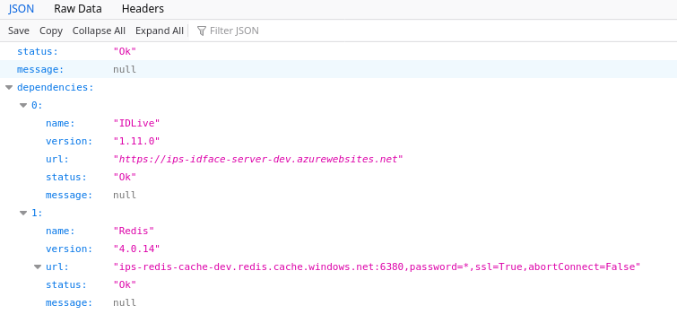

# Proof/Verified Web - Customer Integration

<!-- TOC -->
- [Proof/Verified Web - Customer Integration](#proofverified-web---customer-integration)
  - [Introduction](#introduction)
  - [FaceLok URLs](#facelok-urls)
  - [Step-By-Step Instructions](#step-by-step-instructions)
  - [Testing](#testing)
  - [FaceLokJS Configuration Parameters](#facelokjs-configuration-parameters)
    - [Parameters](#parameters)
  - [Messages](#messages)
    - [FaceLokJS -> User](#facelokjs---user)
      - [LIVENESS_FEEDBACK VALUES](#liveness_feedback-values)
    - [User -> FaceLokJS](#user---facelokjs)
  - [Errors](#errors)
  - [Reference](#reference)
<!-- /TOC -->

## Introduction

The basic steps to integrate to FaceLokJS from your javascript are:

1. Create a FaceLok object using the parameters as defined in the FaceLok Configuration Parameters section.
2. Start the FaceLokWeb session in FaceLokJS by calling startVerification().
3. Customer performs a liveness check.
4. Receive LIVENESS_FINISHED message on success.
5. Close the session by calling stopVerification().

## FaceLok URLs

These are the URLs needed in your code to interface with our systems.

| System | Type | URL |
| ------ | ---- | --- |
| FaceLok Web | Production | https://id.ipsidy.net/flwa |
| FaceLok Web | QA | https://id-qa.ipsidy.net/flwa |

**NOTE**: In the example code below we are showing the QA urls.

Health check of the system can be done by querying https://id.ipsidy.net/flwa/api/HealthCheck.  The healthy results will look like:



## Step-By-Step Instructions

All code will be provided at the end of this section rather than inline in pieces.

- Start an empty project (using webstorm, or IDE/editor of choice)
- Create an index.html file, here is the skeleton:
- Add facelok.js to your project (in this case root directory)
- Create a main.js file in your project
- Update your index.html to load both script files like so:
- In main.js create the stream variable at global scope
- Create a startup() function that we will use to instantiate and establish a connection to the FaceLokWeb server.

| Note |
| :--- |
| In the documented startup() function, we are utilizing some pieces that we haven’t covered yet.  Like the beginButton and the video and photo elements.  Those will be covered in later steps.<br> For the faceLokParams object please see the 2.3 FaceLok Configuration section below for details on those values and creating the FaceLok object. |

- Next create a video and image element in your index.html.  The video element will hold the camera view.  The image should be hidden as it mirrors the camera. Once the process is complete the img will have the resulting image.  At this point we will hide the video element and show the image. 

- Now we clean up the interface a bit.  We will link a button to start the process, then setup some css to show/hide elements as necessary and link a text field for providing a bit of feedback.  

- Next we need to add a callback for the messages from FaceLokJS. We do this in our main.js by adding a faceLokMessages() function.  This will be configured in the startup() faceLokParams in a field called messagingCallback.  For more information on what messages can come through and their parameters, see section 2.4 Messages.

- In the handler we show some basic message handling to show how the flow can work.  This includes showing the video when we get the READY message, and then showing complete and hiding the video while showing the image on the LIVENESS_FINISHED message.  All other messages are either ignored or logged to the console.

- The code also has a function named shutdownApp. This function is just used when an unhandled message is received (possibly an error message). It shuts down the camera and closes the session with the FaceLokWeb server by calling stopVerification().

| Note |
| :--- |
| The example code snippets were removed from this document.  They are available as index.html and main.js in the package this document was delivered with. |

## Testing

If you followed the step by step instructions above, you should be able to run your project in a browser.  It will prompt you for access to the camera when you click the **Begin** button.  Then you should see a video.  Smile off and on for the camera to verify liveness and it should progress to a **Complete** step where you see your captured still image.

You can activate debug mode so you can see the facial points by adding `debug=true` to your url.

## FaceLokJS Configuration Parameters

Configuration for the FaceLokJS system can be loaded from a configuration file (JSON) or passed in as raw JSON into the creation call for FaceLok in your javascript.

The following code shows a FaceLok instantiation and the parameters being passed as raw json.

`main.js:`
```js
try {
        var faceLokParams = {
            "videoElem": document.querySelector('#video'),
            "photoImgElem": document.querySelector('#photo'),
            "messagingCallback": faceLokMessages,
            //"configUrl": "FaceLokWebConfig.json"
 
          // Below fields can be put into the configUrl value
          // instead of being put directly into this object
            "faceLokWebUrl": https://id-qa.ipsidy.net/flwa,
            "imageStreamIntervalMs": "0"
        };
 
        faceLokObj = new FaceLok(faceLokParams, () => {
            faceLokObj.startVerification();
        })
    } catch (e) {
        console.log("Error: " + e.toString());
    }
```

Here you will notice a commented out configUrl parameter.  If you were to specify a file or a url here pointing to that file, the system would attempt to load that file for configuration data.  An example of that file would be:

`FaceLokWebConfig.json:`
```js
{
    "faceLokWebUrl": "https://id-qa.ipsidy.net/flwa",
    "desiredTechniques": [ "image-stream" ],
    "imageStreamIntervalMs": "0",
}
```

Alternatively, you can just pass that JSON directly in the facelokParams object you created in your javascript.  That is the way that is being used in the code example above.

### Parameters

| JSON Parameter | Description | Values |
| -------------- | ----------- | ------ |
| videoElem | The DOM video tag element that you’d like to use for displaying the camera output. | Any video element |
| photoImgElem | The DOM img tag element that you’d like to use to display the accepted liveness photo. This tag will also show the video, and in debug mode will show facial landmarks. | Any img element |
| messagingCallback | The callback function that will accept messages from FaceLokJS. More details below in the References section. | A javascript function with one parameter |
| configUrl (optional) | An url to an JSON file that has config values for FaceLokJS. Note- This field can be left blank if passing in values to the constructor via an object (such as faceLokParams in the Hello World application) | URL to a json file |
| faceLokWebUrl | URL of FaceLokWeb server | URL to FaceLokWeb server |
| desiredTechniques | Array list of the techniques in the order that you’d like to attempt to verify liveness. In this way you can specify fallback techniques that FaceLokJS will attempt to use in case the connection cannot be sustained at the initially requested technique’s minimum level (slow connections, etc) | Only "image-stream" is currently supported |
| imageStreamIntervalMs | If using the “image-stream” technique integer number represents the desired number of milliseconds that you’d like to stream images at. If you enter 0 then FaceLokJS will attempt to stream images as fast as it can to the FaceLokWeb server. | Integer values >= 0|
| sourceOperationId | Unique ID of the high-level operation that triggered biometric authentication. This is optional field only required when FaceLok Web backend is configured with “Limits:MaxSessionsPerSourceOperationId” mode and allows backend to implement biometric session limits.  | String |
| debug | Setting debug to true will allow you to see additional information in the photoImg element. This information includes landmark points from the FaceLokWeb server, and additional metrics | true |

## Messages

The following table shows the messages that are sent to/from FaceLokJS.  These are what will arrive in the `eventObj.message` field in the `faceLokMessages()` callback.

### FaceLokJS -> User

These messages go from FaceLokJS to the User’s javascript code.

| Message | Description | Parameter |
| ------- | ----------- | --------- |
| LIVENESS_FEEDBACK | These messages provide feedback to the client program on the current liveness process. | Please see [table](#LIVENESS_FEEDBACK-VALUES) below for details on possible values. |
| LIVENESS_FINISHED | The liveness process has completed. | Session URL that can be used to access the image.  The URL returned here can be used by adding /image to the end.  An example URL would look like:<br> https://ip-qa.ipsidy.net/flwa/api/LivenessTest/QP2elSifbZyUDqPU/image <br> Note, that has the /image added.  The code used to do that is: <br> `$("#livenessPhoto").attr("src", eventObj.value1 + "/image")` |
| LIVENESS_PROCESSING | The system has received all the data and images it needs for testing liveness and is working on liveness testing.  When complete the LIVENESS_FINISHED message will be sent. | None |
| MOTION_ACCEPTABLE | Facelok has determined the level of motion is acceptable for a quality image. | None |
| MOTION_NOT_ACCEPTABLE | Facelok has determined the level of motion is unacceptable for a quality image. | None |
| READY | The connection has been established and is working properly with the facelok back end | None |
| SESSION_ENDED | The Facelok session has ended. Usually this indicates an error situation or that the maximum session time is reached | Can be:<br> TIMEOUT_LIVENESS_PHASE (which is 45 seconds)<br> TIMEOUT_PROCESSING_PHASE (which is 45 seconds) |
| TECHNIQUE_SET | Facelok is reporting that it has changed to a new processing technique. Note – Currently only the “image-stream” technique is supported. | The newly set technique |

#### LIVENESS_FEEDBACK VALUES

| Value | Description |
| ----- | ----------- |
| PleaseSmile | FaceLok requires a smile from the user |
| PleaseUnsmile | FaceLok needs the user to stop smiling |
| NoFace | Can not detect a face in the image |
| MultipleFaces | FaceLok is detecting multiple faces.  This is not allowed and processing can not continue. |
| FaceTooSmall | The face detected in the image is too small for liveness processing.  User needs to move closer. |
| LowLivenessScore | The liveness score on the image is low and did cause a liveness failure. |
| HotSpot | A glare (hotspot) has been detected in the image |

### User -> FaceLokJS

These messages can be sent from the User’s javascript to FaceLokJS.

| Message | Description | Parameter |
| ------- | ----------- | --------- |
| | Currently there are no messages supported | |

## Errors

These are the errors that can be sent to the message callback.  They will come in on the `eventObj.message` field.

| Error | Description |
| ----- | ----------- |
| ERROR_TRIGGER_EVENT_INSTANCE_LOCKED | triggerEvent called but the FaceLok instance has been locked (as a result of an error situation), and is no longer accepting events. |
| ERROR_TRIGGER_EVENT_NOT_KNOWN | The event sent to triggerEvent was not know. |
| ERROR_TRIGGER_EVENT_START_NOT_LOADED | triggerEvent called before the FaceLok instance has finished loading it's configuration file JSON file. |
| ERROR_TRIGGER_EVENT_START_VERIFY_NOT_CALLED | riggerEvent called before startVerification has been called. |
| ERROR_START_VERIFY_INSTANCE_LOCKED | startVerification called but the FaceLok instance has been locked (as a result of an error situation), and is no longer accepting events. |
| ERROR_START_VERIFY_CONFIG_NOT_LOADED | startVerification called before the FaceLok instance has finished loading it's configuration file JSON file. |
| ERROR_START_VERIFY_ALREADY_CALLED | startVerification called more then once |
| ERROR_STOP_VERIFY_CONFIG_NOT_LOADED | stopVerification called before the FaceLok instance has finished loading it's configuration file JSON file. |
| ERROR_STOP_VERIFY_START_VERIFY_NOT_CALLED | stopVerification called before startVerification |
| ERROR_STOP_VERIFY_INSTANCE_HAS_BEEN_INVALIDATED | The session has timed out on the facelokweb backend.  Restart your session.  Currently there is a 10 minute timeout on the session.  This could also occur if the session was closed by the user. |
| ERROR_NETWORK_QUALITY_UNACCEPTABLE | The network throughput is too low to properly use the FaceLok system.  Use a faster network connection. |
| ERROR_TIMEOUT | The request to the backend server (FLWA) timed out. |

## Reference

`FaceLok(faceLokParams, finishedCallback)` - Constructor function used to initialize the connection to the FaceLokWeb server. The finishedCallback parameter can be used for notification after the connection is established.

`messagingCallback(facelokEventObj)` - This function is set in faceLokParams "messagingCallback" and therefore can have any name the user wishes. Messages from FaceLokJS are passed to this function. A list of messages to this function can be found in the [FaceLokJS -> User](#facelokjs---user) section and the [Errors](#errors) section.

`facelokEventObj` - This object is passed to the messagingCallback function you specify
- `message` - The actual message being passed.
- `value1` - If an event has addition data to pass to the user it can put data into this variable as it likes.
- `value2` - If an event has addition data to pass to the user it can put data into this variable as it likes.
- `isError()` - A convenience function used to identify if the type of message is an error message.
- `isMessage()` - A convenience function used to identify if the type of message is a normal message.

This object can possibly have more fields and methods depending on the unique requirements for each message type.

`triggerEvent(message)` - The function used to pass events from the User to FaceLokJS. More details about acceptable messages can be found in [User -> FaceLokJS](#user---facelokjs).

`startVerification(finishedCallback)` - Starts analyzing the video stream for liveness indicators. The finishedCallback can be used for notification when startVerification is finished loading.

`stopVerification()` - Closes the current FaceLokWeb server connection. The current FaceLok class instance will be locked in a non functioning state at this point. You will have to create another instance of FaceLok if you wish to perform another liveness verification.

#

[Back to Main Page](../README.md)