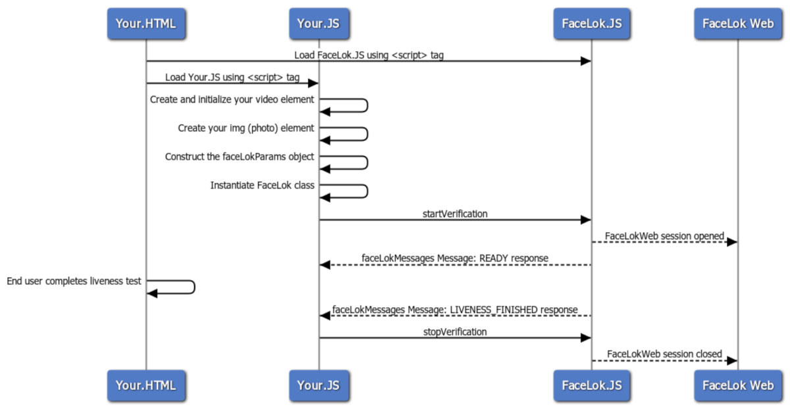

# Proof/Verified Web - Overview

FaceLok Web is an HTML5 based solution that uses a web browser’s camera API to capture a user’s photo and verify liveness.  Liveness is verified using two methods:  

1. Active liveness – requires the user to perform specific actions such as smiling in front of the camera. 
2. Passive liveness – analyzes image for photo manipulation, masks, and other attack vectors. 

You can easily integrate FaceLok Web into your own web application by using JavaScript to activate this process.  

**Developer’s Note** - The browser being used during the transaction must support allowing the web application to access the video stream from the camera. From our testing on mobile devices, currently only Safari allows this access on IOS. Likewise Chrome is the only browser that is allowed to access the camera stream on Android. All major browsers on desktop os’s seem to support access to the camera as long as the protocol restrictions (below) are met. 

All browsers that we tested require using the https protocol when using a non-local IP address or DNS lookup, otherwise the web application will not be able to access the camera stream. When testing locally using file:///, the loopback IP (127.0.0.1), or localhost  - we have not run into this limitation.  

The sequence diagram below outlines the complete process. 

#

[Back to Main Page](../README.md)